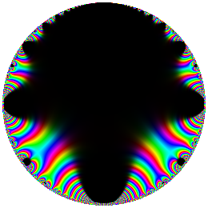
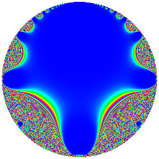
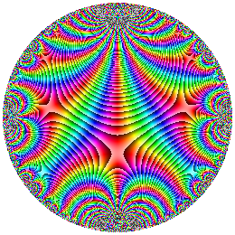
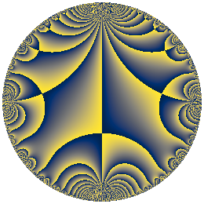

# mod-forms

Plotting tools for visualizing modular forms, implementing the techniques
surveyed in

> David Lowry-Duda, ["Visualizing Modular Forms"](https://arxiv.org/abs/2002.05234), arXiv:2002.05234.

The paper looks at several ways to turn a complex-valued modular form into
a picture — domain coloring, magnitude-only plots, phase plots, phase
plots with magnitude contours — and introduces a way to plug in
matplotlib's perceptually-uniform colormaps (`viridis`, `cividis`,
`twilight`, ...). This repo implements all of it in vectorized NumPy, on
both the upper halfplane and the Poincare disk.

| Standard domain coloring | Periodic magnitude (LMFDB style) |
|---|---|
|  |  |
| **Phase plot with contours** | **Colormap phase plot (cividis)** |
|  |  |

(All four are the Ramanujan Delta function, weight 12 level 1, on the
Poincare disk.)

## Install

```bash
pip install -e .
```

(or just `pip install -r requirements.txt` and add `src/` to your
`PYTHONPATH` — the only dependencies are `numpy` and `matplotlib`.)

## Quick start

```bash
python -m modforms.cli plot --form delta --region disk --style phase-contour --cmap cividis --out delta.png
```

```python
from modforms import forms, plotting

delta = forms.delta(400)  # 400 Fourier coefficients, as in the paper
plotting.plot_form(
    delta,
    region="disk",              # or "halfplane"
    style="phase-contour",      # see styles below
    out="delta.png",
)
```

Run `python examples/reproduce_delta_gallery.py` to regenerate a full
gallery (all styles, disk + halfplane) into `output/`.

## Styles

Each corresponds to a subsection of the paper:

| `--style` | Paper section | Description |
|---|---|---|
| `standard` | 2.2.1 | hue = phase, brightness = magnitude (0=black) |
| `magnitude` | 2.2.2 | grayscale, magnitude only, no phase |
| `periodic-linear` | 2.2.3 | hue = magnitude mod 1 (LMFDB-style medallions) |
| `periodic-log` | 2.2.4 | hue = log(magnitude) mod 1 |
| `phase` | 2.2.5 | hue = phase only, magnitude ignored |
| `phase-contour` | 2.2.6 | phase plot with magnitude contours (Wegert-style) |
| `colormap-phase` | 3 | phase plot using an arbitrary matplotlib colormap |
| `colormap-phase-contour` | 3 | colormap phase plot + magnitude contours |
| `colormap-magnitude` | 3 | colormap applied to (periodic) magnitude |
| `colormap-standard` | 3 | colormap hue + magnitude-as-brightness |

Every style is a plain function `f(values, **kwargs) -> RGB array` in
`modforms/coloring.py`, so it's easy to add your own.

## Built-in forms

- `delta(n_terms=400)` — the Ramanujan Delta function (weight 12, level 1).
  Computed exactly via the pentagonal number theorem, no external data
  needed.
- `eisenstein(k, n_terms=400)` for `k in {4, 6, 8, 10, 14}` — level-1
  Eisenstein series, also computed exactly.

The paper's other three running examples (`g`, weight 4 level 5; `f_105`,
weight 2 level 105; `f_10`, weight 20 level 10) are LMFDB newforms with
non-trivial coefficients — see "Importing from the LMFDB" below for the
easiest way to pull those in directly, or `examples/custom_form_example.py`
for loading coefficients by hand with `QExpansion.from_list`/`from_csv`.

## Importing from the LMFDB

`modforms.lmfdb` talks to the [LMFDB's public API](https://www.lmfdb.org/api/)
to browse and import newforms directly, so you don't have to copy
coefficients by hand.

Browse forms by level/weight:

```bash
python -m modforms.cli search --level 105 --weight 2
```

```python
from modforms import lmfdb
lmfdb.print_newforms(level=105, weight=2)
for doc in lmfdb.search_newforms(level=105, weight=2):
    print(doc["label"], doc["dim"])
```

Fetch a form's q-expansion and plot it directly, using either the
Galois-orbit label from the paper (e.g. `5.4.a.a`, which assumes the first
embedding) or a fully embedded label (`5.4.a.a.1.1`):

```bash
python -m modforms.cli plot --lmfdb 5.4.a.a --region disk --style phase-contour --out g.png
```

```python
from modforms import lmfdb, plotting

g = lmfdb.fetch_qexpansion("5.4.a.a", n_terms=400)
plotting.plot_form(g, region="disk", style="phase-contour", out="g.png")
```

**Caveat:** this was written against the LMFDB API's documented shape
(`mf_newforms` for search, `mf_hecke_cc` for numerical q-expansion
coefficients), but the sandbox this was developed in has no network
access to `lmfdb.org`, so it could not be exercised against a live
response. Field names are isolated as constants at the top of
`modforms/lmfdb.py`; if the real API returns different field names,
`fetch_qexpansion`/`search_newforms` will raise `LMFDBSchemaError` showing
the actual keys in the response, which should make it a one-line fix.
Please open an issue (or just fix it) if you hit that.

## How it works

`modforms/grid.py` builds a grid of points on the upper halfplane (a box
`[x0,x1] x [y0,y1]`) or on the Poincare disk (via the Moebius transform
`phi(w) = (1 - i*w) / (w - i)` from Section 2.1, masking points outside the
unit disk). `modforms/qexpansion.py` evaluates a truncated q-expansion
`sum a_n q^n` on that grid with Horner's method. `modforms/coloring.py`
turns the resulting complex array into RGB pixels for each style, using a
from-scratch vectorized RGB<->HSL conversion (`modforms/hsl.py`) to
implement the magnitude-contour trick from Remark 2 of the paper: a
sawtooth in `log_base(|f|) mod 1` is used as a lightness adjustment, so
contours appear as sharp light/dark transitions without ever being
computed explicitly.

## Layout

```
src/modforms/
  grid.py         halfplane/disk grids, disk<->halfplane Moebius map
  qexpansion.py   evaluate a truncated q-expansion on a grid
  forms.py        built-in forms (Delta, Eisenstein series)
  hsl.py          vectorized RGB <-> HSL
  coloring.py     the plotting styles (Sections 2 and 3 of the paper)
  plotting.py     evaluate_on_region / render / save_png / plot_form
  presets.py      the regions used in the paper's figures
  lmfdb.py        import/browse newforms from the LMFDB's API
  cli.py          command-line interface
examples/
tests/
```

## Tests

```bash
pip install pytest
pytest
```
